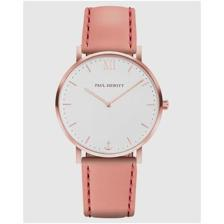
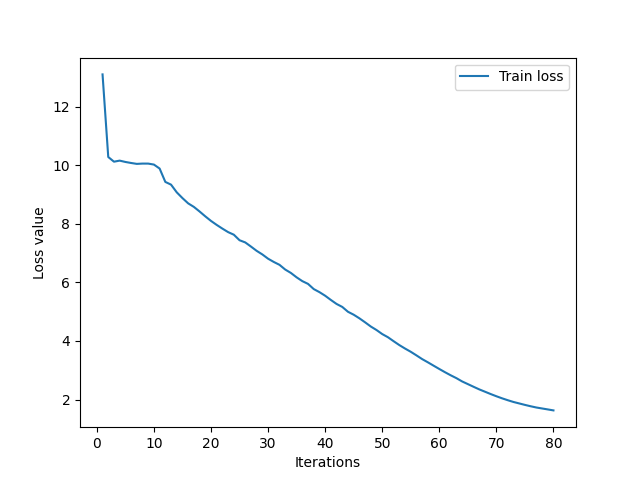
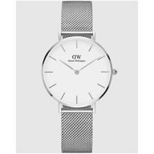

# Blip-captioner-on-fashion-datasets
Finetuning blip on pairs of fashion products (image and a detailed description) to automatise captioning fashion product images)
## Packages nécessaires
Trois packages nécessaires à installer (torch, datasets et transformers) dont deux sont installables depuis le fichier requirements.txt via la commande 

```python
pip install -r requirements.txt
```
## Dataset
Le dataset utilisé pour l'entaînement est importé depuis huggingface (cf https://huggingface.co/docs/datasets/v1.16.0/upload_dataset.html por voir comment uploader et importer un dataset depuis huggingface:

Le dataset contient deux colonnes: image et description détaillée comme ci-dessous

<table>
  <tr>
    <td align="center">
      
    </td>
  </tr>
  <tr>
    <td align="center">
      <strong>a watch with pink leather strap and rose bezel with circular white dial with roman numerals</strong>
    </td>
  </tr>
</table>

Le modèle utilisé est blip: (https://github.com/salesforce/BLIP) pour la génération des captions inconditionnellement depuis une image:

## Entraînement:

Le modèle a été finetuné sur le dataset pour 80 itérations :

<table>
  <tr>
    <td align="center">
      
    </td>
  </tr>
  <tr>
    <td align="center">
      <strong>Courbe de loss du modèle</strong>
    </td>
  </tr>
</table>

On s'est arrêté au bout de 80 itérations afin d'éviter l'overfitting:

## Résultats

On peut comparer les résultats du captioning avant et après le finetuning du modèle:

<table>
  <tr>
    <td align="center">
      <strong>Before fintuning the model </strong>
      <br>
      
      <br>
      <strong>a white watch with a mesh strap</strong>
    </td>
    <td align="center">
      <strong>After finetuning the model</strong>
      <br>
      
      <br>
      <strong>a watch with silver mesh grid bracelets and circular white dial with a grey bezel and grey</strong>
      <br>
    </td>
  </tr>
</table>


